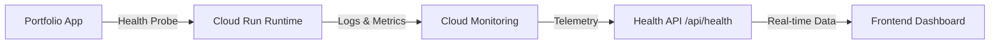

---
title: Portfolio Overview & Architecture
description: Cloud-native portfolio with live monitoring, CI/CD, and Infrastructure as Code
---

import { Card, CardGrid } from '@astrojs/starlight/components';

<CardGrid>
  <Card title="Cloud Native Application" icon="rocket">
    Not just a portfolio — a fully-fledged cloud application with real-time monitoring, automated deployments, and infrastructure as code.

    [View Live Demo &rarr;](https://grepme.dev)
  </Card>
  <Card title="Live Monitoring Dashboard" icon="laptop">
    Real-time metrics visualization showcasing uptime, latency, and resource usage with automated health telemetry.

    [Check Health Status &rarr;](https://grepme.dev/api/health)
  </Card>
</CardGrid>

## ⚡ Quick Overview

:::note[Live Production Environment]
🚀 **Production URL:** [grepme.dev](https://grepme.dev)  
📊 **Monitoring API:** [Health Check Endpoint](https://grepme.dev/api/health)
:::

:::note[Platform Evolution Journey]
☁️ **Originally deployed on Microsoft Azure** with comprehensive Bicep IaC templates.  
🚀 **Migrated to Google Cloud Platform** in October 2024 for cost optimization and performance improvements.  
[View Migration Story &rarr;](migration/)
:::

## 🛠️ Tech Stack

#### Frontend
```yaml
Framework: Next.js 14
Language: TypeScript
Styling: Tailwind CSS
Animations: Framer Motion
Charts: Recharts
```

#### Backend & Cloud
```yaml
API: Next.js API Routes (Serverless)
Platform: Google Cloud Platform (Cloud Run)
Container: Docker (Multi-stage Alpine)
Secrets: Google Secret Manager
```

#### DevOps & Platform
```yaml
CI/CD: GitHub Actions (Immutable digest tags)
IaC: Terraform 1.5+ (Google Provider)
Monitoring: Google Cloud Monitoring & Logging
Email: Hybrid Zoho SMTP & SendGrid Fallback
```

## 🌟 Key Features

- 📊 **Live Monitoring Dashboard:** Real-time display of application health metrics including uptime, latency, and memory usage
- 🔄 **Automated CI/CD Pipelines:** Automated build, test, and deployment workflows with Docker container image scanning
- 📜 **Infrastructure as Code:** Declarative Terraform configurations with remote state management
- 🐳 **Containerized Application:** Next.js standalone container deployed to serverless GCP Cloud Run
- 🌓 **Light/Dark Mode:** Seamless theme switching with persistent user preference
- 🛡️ **Zero Hardcoded Secrets:** Runtime injection via Cloud Secret Manager

## 🚀 Local Development

```bash
# Clone the repository
git clone https://github.com/mvulcu/devops-portfolio.git
cd devops-portfolio

# Install dependencies
pnpm install

# Start development server
pnpm dev
```

## 📊 Monitoring Architecture



## 🔄 Evolution Journey

[Original Azure Architecture &rarr;](deployment/) &bull; [Migration to GCP &rarr;](migration/) &bull; [Monitoring Strategy &rarr;](monitoring/)